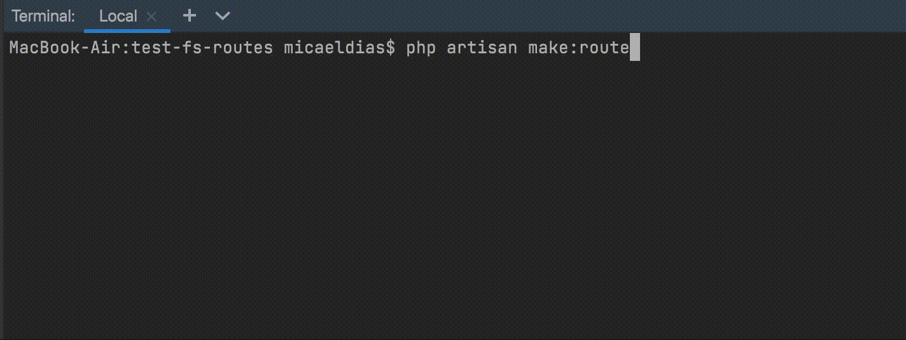

# Single file routes for Laravel

[](https://packagist.org/packages/micaeldias/laravel-single-file-routes)
[](https://github.com/micaeldias/laravel-single-file-routes/actions?query=workflow%3Arun-tests+branch%3Amain)
[](https://github.com/micaeldias/laravel-single-file-routes/actions?query=workflow%3A"Fix+PHP+code+style+issues"+branch%3Amain)
[](https://packagist.org/packages/micaeldias/laravel-single-file-routes)

Single file routes allows you to co-locate everything about a route into a single file. See the route method, URI, middleware and it's behaviour at a glance without the need to keep track of multiple files. 

```php
namespace App\Http\Routes\Api\User;

use Illuminate\Http\Request;
use App\Http\Routes\Api\ApiRouteGroup;
use MicaelDias\SingleFileRoutes\Routing\Route;

/**
 * @uses ApiRouteGroup
 */
class Get extends Route
{
    public static string $method = 'GET';

    public static string $uri = '/user/{id}';

    public static array $middleware = [];

    /**
     * Handle the request.
     */
    public function __invoke(Request $request, int $id)
    {
        // return view('user', ['id' => $id]);
        // return new JsonResponse(['id' => $id]);
        // or any other response supported by Laravel.
    }
}
```

## Compatibility

| Laravel version | PHP version | Package version |
| ----- | ----- | ----- |
| 8 | 7.4 - 8.1 | 1 |
| 9 - 10 | 8.0 - 8.2 | 2 |

## Installation

You may install single file routes into your project with:
```bash
composer require micaeldias/laravel-single-file-routes
```

After installing, publish the assets using the `single-file-routes:install` Artisan command:

```bash
php artisan single-file-routes:install
```

## Configuration

After publishing single file routes' assets, its primary configuration file will be located at `config/single-file-routes.php`. Each configuration option includes a description of its purpose, so be sure to thoroughly explore this file.

## Usage

### Route Groups
To get started you need to create at least one route group, you can have a single one for all your routes or multiple ones such as web/api, there are no limitations on how you structure your app.

```bash
php artisan make:route-group
```


### Routes

Once you have at least one route group you can start creating routes, by default the route will be namespaced according to the URI, so `/api/user` would be stored under the `App\Http\Routes\Api\User` namespace. This is customisable when running the command.

```bash
php artisan make:route
```



### Route names

The routes' names are the same as their definition meaning you can simply pass the class name in Laravel's `route` method to get the URL.

```php
use App\Http\Routes\Api\User\Get as UserGet;

route(UserGet::class) # http://localhost/api/user
```

### Adding middleware

You can use any middleware supported by Laravel directly in the route or the route group. As expected, middleware added to the route group applies to all routes belonging to it.

```php
public static array $middleware = [
    Authenticate::class,
    'throttle:30,1',
];
```

### Using a different structure

If you want to customise how routes are organised you're free to do so. For example, let's say you want to add routes to an application using a domain driven design structure.

You'd first need to create a route group in a namespace that makes sense for your project. 

Let's use `App\Http`:

```bash
php artisan make:route-group --name Web --namespace=App\\Http --no-interaction
#   INFO  RouteGroup [app/Http/WebRouteGroup.php] created successfully.  
```

Then using the route group you've just created, you can add routes to it in a completely different namespace, like so:

```bash
php artisan make:route --group=App\\Http\\WebRouteGroup --namespace=App\\Domain\\Auth\\Http --name=Register --uri=/auth/register --method=POST
#   INFO  Route [app/Domain/Auth/Http/Register.php] created successfully. 
```

There's really no limitations on how you choose to structure your application.

### Changing the base Route

By default, all generated routes extend `MicaelDias\SingleFileRoutes\Routing\Route` which include both `AuthorizesRequests` and `ValidatesRequests` traits from Laravel. If you prefer, you can have all your routes extend a custom class to add functionality that's available on all your routes. 

To do so, update the 'route-class' value found on `config/single-file-routes.php`. 

Keep in mind that the route generators were created for your convenience, but you're of course free to manually create routes or groups if it's simpler for your use-case.

## Changelog

Please see [CHANGELOG](CHANGELOG.md) for more information on what has changed recently.

## Contributing

Please see [CONTRIBUTING](CONTRIBUTING.md) for details.

## Security Vulnerabilities

Please review [our security policy](../../security/policy) on how to report security vulnerabilities.

## Credits

- [Micael Dias](https://github.com/micaeldias)
- [All Contributors](../../contributors)

## License

The MIT License (MIT). Please see [License File](LICENSE.md) for more information.
