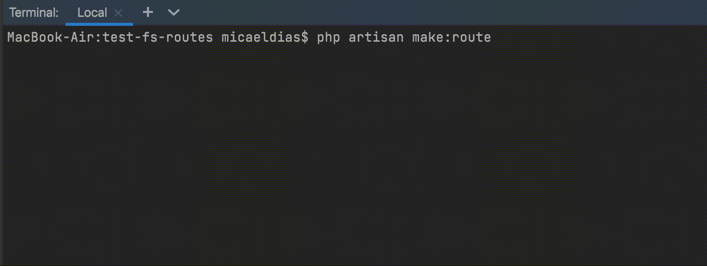

# Single file routes for Laravel

[](https://packagist.org/packages/micaeldias/laravel-single-file-routes)
[](https://github.com/micaeldias/laravel-single-file-routes/actions?query=workflow%3Arun-tests+branch%3Amain)
[](https://github.com/micaeldias/laravel-single-file-routes/actions?query=workflow%3A"Fix+PHP+code+style+issues"+branch%3Amain)
[](https://packagist.org/packages/micaeldias/laravel-single-file-routes)

Single file routes allows you to co-locate everything about a route into a single file. See the route method, URI, middleware, and it's behaviour at a glance without the need to keep track of multiple files. 

```php
namespace App\Http\Routes\Api\User;

use App\Http\ApiRouteGroup;
use Illuminate\Http\Request;
use MicaelDias\SingleFileRoutes\Routing\Route;

#[Route(method: 'GET', uri: '/user/{id}', group: ApiRouteGroup::class)]
class Get
{
    /**
     * Handle the request.
     */
    public function __invoke(Request $request, int $id)
    {
        // return view('user', ['id' => $id]);
        // return new JsonResponse(['id' => $id]);
        // or any other response supported by Laravel.
    }
}
```

You can still register routes like you're used to in conjunction with this package, this is not an all-in package.

## Compatibility

| Laravel version | PHP version | Package version |
| ----- | ----- | ----- |
| 8 | 7.4 - 8.1 | 1 |
| 9 - 10 | 8.0 - 8.2 | 2 |
| 9 - 10 | 8.0 - 8.2 | 3 |

## Installation

You may install single file routes into your project with:
```bash
composer require micaeldias/laravel-single-file-routes
```

After installing, publish the assets using the `single-file-routes:install` Artisan command:

```bash
php artisan single-file-routes:install
```

After publishing single file routes' assets, its primary configuration file will be located at `config/single-file-routes.php`. 

## Usage

### Single Action Controllers

To register a route in a single action controller, simply add the `Route` attribute to the class itself:

```php
#[Route(method: 'GET', uri: '/user/{id}')]
class Get {
    __invoke (Request $request, int $id) {
        // Handle the request
    }
}
```

### Basic Controllers

To register a route in a basic controller, you need to the `Route` attribute to the method instead:

```php
class UserController 
{
    #[Route(method: 'GET', uri: '/user/{id}')]
    public function show(int $id): View
    {
        return view('user.profile', [
            'user' => User::findOrFail($id)
        ]);
    }
}
```

### Route Groups

To use a route group, you first need to create one. This is easily done using the artisan command `make:route-group` explained below.

The route group extends the following interface:
```php
interface RouteGroup
{
    /**
     * The URI prefix for all routes on this group.
     */
    public static function prefix(): string;

    /**
     * The middleware used for all routes on this group.
     */
    public static function middleware(): array;

    /**
     * Assign this route group to a subdomain.
     */
    public static function domain(): ?string;
}
```

Once you've created your desired route group, you can start adding routes under it. Let's say we create an `ApiRouteGroup`, to use it on a route we can simply pass the `group` param on the `Route` attribute, as such:

```php
#[Route(method: 'GET', uri: '/user/{id}', group: ApiRouteGroup::class)]
```

### Route names

By default, routes' names are the same as their definition meaning you can simply pass the class name in Laravel's `route` method to get the URL.

#### Single Action Controllers

```php
use App\Http\Routes\Api\User\Get as UserGet;

route(UserGet::class) # http://localhost/api/user
```

#### Basic Controllers

```php
route('App\Http\Controllers\UserController::index()')
```

#### Custom Route Names

If you don't like having the route name the same as it's definition you can pass the `name` param on the `Route` attribute:

```php
#[Route(method: 'GET', uri: '/user/{id}', name: 'users.show')]
```

### Adding middleware

You can use any middleware supported by Laravel directly in the route or on route groups to be used by all routes under it.

#### Route Group Middleware

To add middleware to the route group, return it from the `middleware()` function:

```php
public static function middleware(): array
{
    return [
        Authenticate::class,
        'throttle:30,1',
    ];
}
```

#### Specific Route Middleware

If you need to add middleware to a single Route, you can pass the `middleware` param on the `Route` attribute:

```php
#[Route(method: 'PUT', uri: '/post/{id}', middleware: ['can:update,post'])]
```

### Multiple Routes

If for some reason you need a controller to respond to multiple URIs, you can stack as many Routes as needed:

```php
#[Route(method: 'GET', uri: '/user', group: ApiRouteGroup::class)]
#[Route(method: 'GET', uri: '/users', group: ApiRouteGroup::class)]
public function show(int $id): View
```

This will make `/user` and `/users` have the same behaviour.

### Route Caching

Laravel's route caching is fully supported.

In fact, due to how routes are discovered, it's highly recommended that you do [cache your routes](https://laravel.com/docs/master/routing#route-caching) in production.

## Artisan Commands

### Generate Route Groups

You can easily create a route group using the `make:route-group` Artisan command:

```bash
php artisan make:route-group {name} {?prefix}
```

Let's say we want to create an API route group:

```bash
php artisan make:route-group ApiRouteGroup /api
# INFO  Route Group [app/Http/Routes/ApiRouteGroup.php] created successfully.
```

Here's how the generated class would look like:

```php
namespace App\Http\Routes;

use MicaelDias\SingleFileRoutes\Routing\RouteGroup;

class ApiRouteGroup implements RouteGroup
{
    /**
     * {@inheritdoc}
     */
    public static function prefix(): string
    {
        return '/api';
    }

    /**
     * {@inheritdoc}
     */
    public static function middleware(): array
    {
        return [];
    }

    /**
     * {@inheritdoc}
     */
    public static function domain(): ?string
    {
        return null;
    }
}
```

### Generate Routes

We only support generating single action controllers using the `make:route` command. 

Follow the prompts to generate the desired route:

```bash
php artisan make:route
```



Here's how the generated class would look like:

```php
namespace App\Http\Routes\Api\User;

use Illuminate\Http\Request;
use MicaelDias\SingleFileRoutes\Routing\Route;
use App\Http\Routes\ApiRouteGroup;

#[Route(method: 'GET', uri: '/user', group: ApiRouteGroup::class)]
class Get
{
    /**
     * Handle the request.
     */
    public function __invoke(Request $request)
    {
        // @todo handle request
    }
}
```

Keep in mind that the route generators were created for your convenience, but you're of course free to manually create routes or groups if it's simpler for your use-case.

## Changelog

Please see [CHANGELOG](CHANGELOG.md) for more information on what has changed recently.

## Contributing

Please see [CONTRIBUTING](CONTRIBUTING.md) for details.

## Security Vulnerabilities

Please review [our security policy](../../security/policy) on how to report security vulnerabilities.

## Credits

- [Micael Dias](https://github.com/micaeldias)
- [All Contributors](../../contributors)

## License

The MIT License (MIT). Please see [License File](LICENSE.md) for more information.
